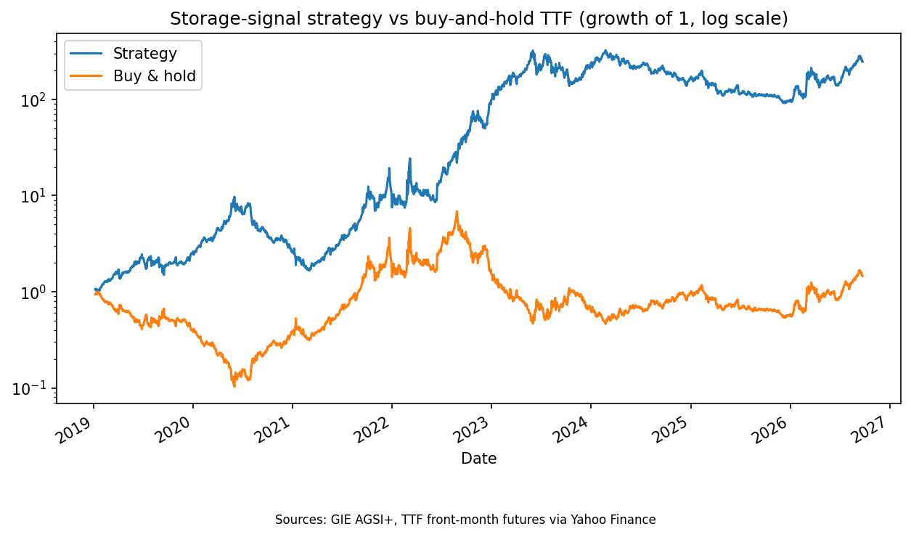
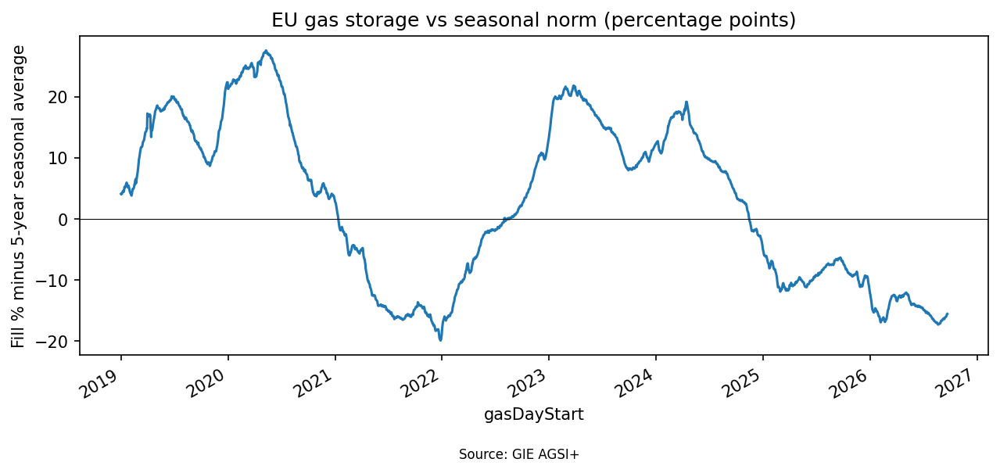

# EU Gas Storage Signal vs TTF Prices

[Open the notebook in Colab](https://colab.research.google.com/github/Jesseshay/ttf-storage-signal/blob/main/TTF_storage_project.ipynb)

**Question:** Do deviations of EU gas storage from its seasonal norm predict TTF gas price moves, and could a simple rule trade it?

## Method
- **Data:** daily EU gas storage fill % from GIE AGSI+; TTF front-month futures from Yahoo Finance.
- **Signal:** storage fill % minus its average for the same day of year over the previous 5 years (past data only, so no look-ahead).
- **Rule:** long TTF when storage is below its seasonal norm, short when above. The signal is lagged 2 days, with a 5bps cost per position change.
- **Parameters** (5-year window, 2-day lag, 5bps cost) were set in advance, not optimised.

## Results
January 2019 to September 2026, about 1,940 trading days, full-size positions, in-sample.

| | Strategy (roll days removed) | Strategy (raw) | Buy and hold |
|---|---|---|---|
| Sharpe ratio (no risk-free rate) | 0.86 | 0.73 | 0.06 |
| Annualised volatility | 83% | 85% | 83% |
| Max drawdown | -83% | -88% | -93% |

Growth of 1 on a log scale with full-size positions. It is not a realistic return, because the volatility is about 83%.

## Holding periods
The rule changed position only 7 times, giving 8 holding periods (log returns):

| Period | Position | Days | Strategy | TTF |
|---|---|---|---|---|
| Jan 2019 - Jan 2021 | short | 510 | +0.83 | -0.83 |
| Jan 2021 - Aug 2022 | long | 390 | +2.25 | +2.26 |
| Aug 2022 (four brief switches) | mixed | 15 | +0.23 | +0.28 |
| Aug 2022 - Nov 2024 | short | 562 | +1.75 | -1.75 |
| Nov 2024 - Sep 2026 (still open) | long | 464 | +0.44 | +0.44 |

The four long-duration positions were all profitable and produced about 96% of total P&L.

## Stress tests
- **By period:** Sharpe was 0.90 (2019-21), 1.95 (2022), 0.00 (2023-25) and 1.53 (2026 to date). Excluding 2022, Sharpe was 0.60.
- **Lookback window:** 3, 5 and 7 years gave Sharpes of 0.76, 0.86 and 0.83.
- **Signal lag:** 1, 2 and 5 days gave 0.79, 0.86 and 0.87.
- **Transaction costs:** 0, 5 and 20bps gave 0.86, 0.86 and 0.86.
- **Concentration:** the 10 best days made up 45% of total P&L. Long and short positions contributed similar amounts.
- **Futures-roll handling:** Sharpe was 0.73 with no adjustment, 0.82 with two days neutralised and 0.86 with three.

## Interpretation
In-sample, the signal was on the right side of all four multi-month TTF regimes since 2019 and was roughly flat in 2023-25. But it changes position rarely, so despite about 1,900 daily observations the result rests on about four regime calls. Robustness to lookback, lag and cost choices is expected for a signal this slow and is only weak evidence. I did not test whether it adds anything beyond simple trend-following.

## Limitations
- Only about 7 winters of data and 4 long regimes, so the results are weak evidence.
- Yahoo's TTF series is not roll-adjusted. Three month-end jumps with no known market event (2019-09-30, 2020-05-29, 2020-08-28) were treated as likely roll artifacts and neutralised. They were identified from month-end timing and the absence of news, not from strategy P&L, but I had seen the raw backtest first, so results with and without the adjustment are reported above.
- Full-size positions with about 83% volatility mean this is not a tradable strategy. There is no position sizing, liquidity or forward-curve information.
- Storage and prices may be driven by the same events (for example the 2021-22 crisis), so this shows correlation, not proof of a causal edge. The August 2022 switch to short may partly reflect high prices driving rapid storage refilling.
- The market may already price in storage expectations.

## Data and how to run it
- Storage data: [GIE AGSI+](https://agsi.gie.eu), used with attribution to Gas Infrastructure Europe. `eu_storage.csv` is the snapshot I downloaded (September 2026).
- Prices: Yahoo Finance, downloaded live by the notebook.
- To run it: open `TTF_storage_project.ipynb` in Google Colab, register for a free GIE API key at agsi.gie.eu, and store it as a Colab secret named `GIE_KEY` (key icon in the left sidebar, with notebook access switched on). Then use Runtime, Run all.

